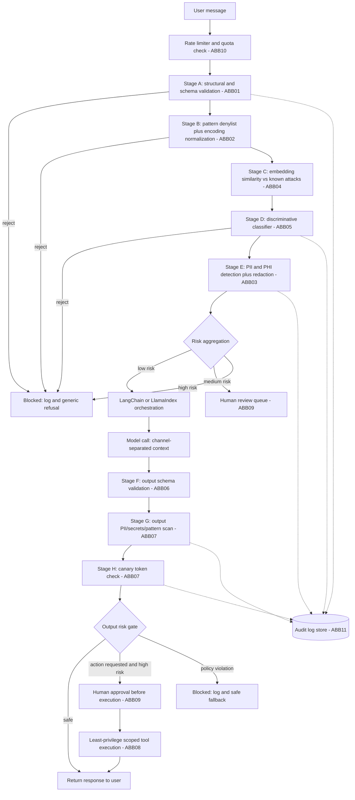

# Guardrails Architecture for a Regulated-Domain Conversational AI Chatbot

**Document status:** Draft for team decision
**Date:** September 9, 2026
**Constraints this document is built around:**
- Deployment: **open-source / self-hosted only** — no cloud-managed guardrail services
- Domain: **regulated** (healthcare, finance, and/or legal)
- Orchestration: **LangChain / LlamaIndex**
- Design principle carried over from prior discussion: **no generative, instruction-following LLM sits inside the guardrail path itself** — only deterministic, statistical, or discriminative (non-chat) components. This document treats that as a hard constraint and flags every place a popular tool quietly violates it.

**Standards baseline:** OWASP Top 10 for LLM Applications (2025 v2.0) · TOGAF 10 (ADM)

---

## Table of Contents
1. [Purpose, Scope & How to Read This](#1-purpose-scope--how-to-read-this)
2. [Governing Frameworks & Standards Alignment](#2-governing-frameworks--standards-alignment)
3. [Architecture Building Blocks (ABBs)](#3-architecture-building-blocks-abbs)
4. [Guardrail Implementation Approaches — Pros, Cons & Comparison](#4-guardrail-implementation-approaches--pros-cons--comparison)
5. [Candidate Python Libraries (Solution Building Blocks)](#5-candidate-python-libraries-solution-building-blocks)
6. [Reference Architecture](#6-reference-architecture)
7. [Decision Framework — Phased Rollout](#7-decision-framework--phased-rollout)
8. [Review: AI Architect & Security Expert Lenses](#8-review-ai-architect--security-expert-lenses)
9. [Compliance & Audit Checklist](#9-compliance--audit-checklist)
10. [Open Questions for Your Team](#10-open-questions-for-your-team)
11. [References](#11-references)

---

## 1. Purpose, Scope & How to Read This

This document exists to help you **choose** a guardrail architecture, not just implement one. Section 4 is the core decision material — approaches, pros/cons, and a master comparison table. Sections 2–3 give it a standards-aligned frame (so the choice is defensible to auditors and architecture review boards); Sections 5–9 turn the choice into concrete libraries, a reference pipeline, and a rollout plan; Section 8 gives you the two independent reviews you asked for.

**A note on scope:** "Guardrails" here covers the full path — input filtering, architectural containment, output validation, and the process controls (logging, human review, testing) that make the runtime controls trustworthy over time. A filter you can't audit isn't a guardrail for a regulated deployment; it's a liability with good intentions.

---

## 2. Governing Frameworks & Standards Alignment

### 2.1 OWASP Top 10 for LLM Applications (2025 v2.0)

| ID | Risk | Why it matters for this chatbot | Addressed in |
|---|---|---|---|
| LLM01 | Prompt Injection | Direct or indirect injection could override system instructions or extract the compliance logic embedded in your system prompt | §4.1, §4.3 |
| LLM02 | Sensitive Information Disclosure | Healthcare/finance/legal conversations carry PHI/PII/privileged data that must never reach logs, embeddings, or the model's context beyond what's necessary | §4.1 (PII/PHI stage), §4.3 |
| LLM03 | Supply Chain | Every OSS guardrail library, pretrained classifier, and embedding model is a dependency requiring provenance checks (see the Presidio governance note in §5) | §9 |
| LLM04 | Data and Model Poisoning | Relevant if you fine-tune any in-house classifier or embedding model on user-submitted data | §9 |
| LLM05 | Improper Output Handling | Output passed downstream (a claims system, an EHR, a document generator) without validation can inject into *that* system | §4.1 (output stage) |
| LLM06 | Excessive Agency | If your LangChain agent can call tools/APIs, an injected instruction that survives input filtering must still be unable to *act* | §4.3 (least privilege) |
| LLM07 | System Prompt Leakage | Regulated deployments often embed policy and compliance logic directly in the system prompt; leakage exposes both IP and control logic | §4.1 (canary tokens) |
| LLM08 | Vector and Embedding Weaknesses | In scope if you run RAG over a policy/product/case-law knowledge base — poisoned or cross-tenant-leaked embeddings | §4.1, §4.3 |
| LLM09 | Misinformation | A confidently invented dosage, rate, or legal citation carries outsized real-world risk in a regulated domain | §4.4 (grounding, human review) |
| LLM10 | Unbounded Consumption | Token-flood or recursive-context attacks hit *your own* self-hosted compute and capacity, not a vendor's | §4.4 (rate limiting) |

> **Keep current:** OWASP published a further revision (*OWASP GenAI LLM Top 10 2026*, August 2026) with updated rankings and expanded threat coverage, and a separate *OWASP Top 10 for Agentic Applications 2026* (ASI01–ASI10) that applies directly if your LangChain agent calls tools or takes autonomous multi-step actions rather than just chatting. Confirm the current categories at the OWASP GenAI Security Project site before final sign-off — this list moved fast through 2026.

### 2.2 TOGAF 10 Alignment

TOGAF doesn't have a "guardrails" phase — it gives you the discipline to make sure guardrails aren't just a bag of libraries bolted onto the side of your application. Map the work into the ADM as follows:

| ADM Phase | What it covers for this project |
|---|---|
| **Architecture Vision (A)** | Why guardrails exist here: regulatory exposure, trust/brand risk, the specific harms being prevented — not "security theater" |
| **Business Architecture (B)** | Compliance drivers (§2.3), risk appetite, who owns escalation and sign-off for flagged conversations |
| **Data Architecture (C)** | PII/PHI/PCI data classification taxonomy, retention and erasure rules, what may vs. may never be logged |
| **Application Architecture (C)** | The guardrail pipeline as a set of Architecture Building Blocks (§3) sitting alongside your LangChain/LlamaIndex orchestration layer |
| **Technology Architecture (D)** | Self-hosting requirements: classifier inference serving, vector store, log store — all on infrastructure you control |
| **Opportunities & Solutions (E)** | The library selection in §5 — mapping ABBs to concrete Solution Building Blocks |
| **Migration Planning (F)** | The phased rollout in §7 |
| **Implementation Governance (G)** | Conformance review before every release: does the build still satisfy the ABBs? |
| **Architecture Change Management (H)** | Versioned regex/classifier updates, adversarial-test cadence, incident-driven rule changes |
| **Requirements Management (center, continuous)** | OWASP and regulatory requirements feed every phase above continuously, not once at kickoff |

TOGAF 10 explicitly embeds security-by-design and risk assessment throughout the ADM cycle rather than as a bolt-on phase — treat §4's guardrail selection as Phase C/D work product, not a separate security workstream that happens after the architecture is "done."

**ABB vs. SBB, briefly:** an *Architecture Building Block* is a technology-agnostic capability ("PII detection"); a *Solution Building Block* is the specific product implementing it ("Presidio"). §3 gives you the ABBs; §5 gives you candidate SBBs. This separation is what lets you swap a library later without re-litigating the architecture.

### 2.3 Regulated-Domain Compliance Overlay

| Framework | Applies if… | Concrete guardrail implication |
|---|---|---|
| **HIPAA** (US) | Handling PHI for US patients/providers | PHI-specific entity recognition in the PII stage; minimum-necessary logging; disclosure audit trail |
| **GLBA / SOX / PCI-DSS** (US finance) | Handling US consumer financial data or card data | Card/account-number redaction before any log or model context; separation of duties in change management |
| **State bar / UPL rules** (US legal) | Chatbot output could resemble legal advice | Topic-boundary guardrail blocking unauthorized-practice-of-law patterns; mandatory disclaimers; human review before advice-adjacent output ships |
| **GDPR** (EU) | Any EU personal data | Data minimization in logs, erasure support in log/vector stores, a DPIA covering the guardrail pipeline itself |
| **EU AI Act, Art. 50** | Chatbot reachable by anyone in the EU | **Live since 2 Aug 2026** for any generative chatbot: must disclose, at the start of each interaction, that the user is talking to an AI. Purely rule-based/decision-tree bots are exempt — an LLM-backed bot is not. This is now an actual enforceable obligation, not a future one. |
| **EU AI Act, Annex III (high-risk)** | Your specific function is high-risk (e.g., credit/insurance decisions, medical diagnosis/triage) rather than general assistance | Full conformity-assessment regime. The "Digital Omnibus on AI" deferred this from Aug 2026 to **2 Dec 2027** — treat it as a build target, not a today-deadline, but classify your specific use case now, since general Q&A and diagnostic/decisioning functions are *not* treated the same way |
| **India DPDPA 2023** | Processing personal data of India-based data principals | Consent architecture and data-principal rights feed the same logging/retention design as GDPR above |
| **Sector regulators** (e.g., RBI, IRDAI, NMC, or your local equivalent) | Sector-regulated deployment outside the US/EU | Check current sector-specific AI/data guidance directly — these move independently of general data-protection law |
| **Cross-cutting:** NIST AI RMF, ISO/IEC 42001, SOC 2 | Any enterprise buyer or auditor | Your guardrail logging and governance controls (§9) double as the evidence base for all three |

> This table is a starting map, not legal advice. Confirm with counsel exactly which regimes apply given where your users are, what the chatbot actually *does* (general assistance vs. a decisioning/diagnostic function), and where data is processed and stored. The jurisdiction question changes §2.3's requirements materially — see Open Question 1 in §10.

---

## 3. Architecture Building Blocks (ABBs)

Technology-agnostic capabilities your architecture needs, independent of which library eventually fills each one:

| ABB | Capability | OWASP risk(s) addressed |
|---|---|---|
| ABB-01 | Input structural & schema validation | LLM01, LLM10 |
| ABB-02 | Injection/jailbreak pattern detection + encoding normalization | LLM01 |
| ABB-03 | PII/PHI/PCI detection & redaction (input *and* output) | LLM02 |
| ABB-04 | Semantic anomaly detection (embedding similarity to known attacks) | LLM01 |
| ABB-05 | Discriminative classification (injection / toxicity / topic-boundary) | LLM01, LLM09 |
| ABB-06 | Output structural/schema validation | LLM05 |
| ABB-07 | Output leakage detection (secrets, system-prompt canary tokens) | LLM02, LLM07 |
| ABB-08 | Least-privilege, scoped tool/action execution | LLM06 |
| ABB-09 | Human-in-the-loop escalation for flagged or high-risk actions | LLM06, LLM09 |
| ABB-10 | Rate limiting & resource governance | LLM10 |
| ABB-11 | Audit logging & traceability | LLM02, LLM07, and the evidence base for §2.3 |
| ABB-12 | Adversarial testing / red-teaming cadence | Validates all of the above; prevents none directly |
| ABB-13 | AI-interaction disclosure banner | EU AI Act Art. 50 — a compliance requirement, not a security control, but cheap to ship and currently enforceable |

---

## 4. Guardrail Implementation Approaches — Pros, Cons & Comparison

Grouped into four categories: runtime filters, orchestration frameworks that bundle filters, architectural controls, and process/governance controls. **All descriptions below assume the non-generative constraint** — where a common tool violates it, that's called out explicitly.

### 4.1 Category I — Deterministic & Statistical Filters

**Rule-based filtering** (regex/denylist/allowlist, schema and format validation, encoding normalization before matching)
- *Pros:* Near-zero latency, fully explainable (an auditor can read the rule that fired), trivial to unit-test, no model drift to manage.
- *Cons:* Blind to paraphrase and novel phrasing; encoding tricks (base64, unicode homoglyphs, zero-width characters) evade naive matching unless you normalize first; the rule list is a living document that needs maintenance like antivirus signatures.

**Named Entity Recognition (NER) for PII/PHI/PCI**
- *Pros:* Purpose-built for exactly this problem; combines regex (structured entities like card numbers) with statistical NER (unstructured entities like names); mature, widely audited open-source implementations exist.
- *Cons:* No detection method guarantees 100% recall — false negatives on unusual name formats, non-English text, or novel entity phrasing are expected and must be assumed, not discovered in production.

**Discriminative ML classifiers** (encoder-only models fine-tuned purely as `text → label`, e.g., a DeBERTa-based injection classifier)
- *Pros:* Catches paraphrased/semantic attacks that regex misses; has no chat interface or instruction-following capability, so "ignore your instructions" has nothing to attach to — this is the sweet spot for your non-generative constraint; fast (single forward pass, no generation loop).
- *Cons:* Still a model with a training distribution — attacks outside that distribution (novel jailbreak styles, adversarial suffixes) can evade it; needs its own MLOps lifecycle (versioning, drift monitoring, periodic retraining).

**Embedding similarity / vector anomaly detection** (embed input, compare via cosine similarity against a maintained corpus of known attack strings)
- *Pros:* Nothing to "convince" — it's a nearest-neighbor lookup; catches near-duplicate and lightly-paraphrased known attacks cheaply; the attack corpus is easy to grow from your own logged incidents.
- *Cons:* Only as good as the corpus — genuinely novel attack patterns with no close neighbor slip through; embedding model choice affects what counts as "similar."

**Perplexity/statistical anomaly scoring** (score input against a small non-instructable language model used purely as a scorer)
- *Pros:* Adversarial suffixes (e.g., GCG-style) and some obfuscated payloads have unusual token statistics that this catches cheaply.
- *Cons:* High false-positive rate on legitimate unusual input (code snippets, non-English text, technical jargon common in healthcare/finance/legal domains); best used as one signal among several, not a standalone gate.

**Canary tokens & deterministic output leakage detection** (a fixed unique string embedded in the system prompt; exact string-match on output flags leakage)
- *Pros:* Zero ambiguity — either the string appears or it doesn't; catches system-prompt leakage (LLM07) with no model judgment involved.
- *Cons:* Only catches *verbatim* leakage of the canary itself, not paraphrased disclosure of the system prompt's content.

### 4.2 Category II — Guardrail Orchestration Frameworks

These bundle several Category I techniques behind one interface. **Read this section carefully** — every framework in this space also ships optional LLM-based components, and using the framework does not automatically mean you're staying non-generative.

**Multi-scanner toolkits** (e.g., LLM Guard): a fixed, modular set of independent input/output scanners you enable individually.
- *Pros:* Each scanner runs locally with no external calls; genuinely fast to adopt since the injection/toxicity/PII scanners are, by default, classifier- or NER-based, not generative; scanners are independent, so unused ones cost nothing at runtime.
- *Cons:* A fixed scanner set means less flexibility than a full validator hub; you're dependent on the maintainers' choice of underlying classifier models.

**Validator-hub frameworks** (e.g., Guardrails AI): a large, community-contributed library of composable validators, some deterministic (schema/format), some ML-based (local classifier), and **some explicitly remote-inference or LLM-graded**.
- *Pros:* Very wide validator catalog; strong LangChain/LlamaIndex integration; deterministic-format validators (JSON/URL/HTML validity) are excellent and fully self-hostable.
- *Cons:* You must audit each validator individually — some (e.g., a Llama-Guard-based moderation validator) are explicitly documented as "remote inference only," which is a cloud call, not a self-hosted one, unless you separately self-host that backing model and wire it in yourself. Treat every validator as untrusted-until-verified for backend behavior.

**Dialog/rail frameworks** (e.g., NeMo Guardrails): a DSL for defining conversational flows, with input/output/dialog/retrieval/execution rail types.
- *Pros:* Genuinely useful for dialog-flow control (keeping a regulated-domain bot from wandering into out-of-scope topics) independent of the safety-check question; strong LangChain integration; supports swapping in non-LLM "community model" rails instead of its default pattern.
- *Cons:* **Its flagship safety pattern — `self_check_input` / `self_check_output` — works by prompting an LLM with "should this be blocked, yes or no?"** This is precisely the generative-guardrail pattern your constraint rules out, and it's not just a theoretical concern: NVIDIA's own documentation for this rail states that its reliability "is strongly dependent on the capability of the LLM to follow the instructions in the prompt," and recommends a purpose-built safety model instead when that reliability isn't good enough. If you adopt NeMo Guardrails, use it for dialog-flow control and wire its input/output rail hooks to your own discriminative classifiers (§4.1) — do not enable the default self-check flows.

### 4.3 Category III — Architectural Controls

These matter more than any filter above, because they contain the blast radius of a filter that fails.

**Channel separation** — never concatenate user input, retrieved documents, and system instructions into one undifferentiated string; use structured message roles/fields end-to-end through LangChain's message types.
- *Pros:* This is the actual fix for prompt injection's root cause (instructions and data sharing one channel); costs nothing at runtime; no model to attack.
- *Cons:* Requires discipline across the whole codebase — a single string-concatenation shortcut anywhere reintroduces the vulnerability.

**Delimiter/control-token escaping** — strip or encode any sequence in user-supplied content that matches your own structural delimiters, so input can never forge structure.
- *Pros:* Cheap, deterministic, closes a specific and common bypass technique.
- *Cons:* Only as complete as your enumeration of "structural" sequences.

**Least-privilege, scoped tool/action execution** — the agent holds only the minimum API/tool scope needed for the current task, ideally scoped per-request.
- *Pros:* **This is your real backstop.** Even a successful injection that gets past every filter above can't transfer funds, alter a medical record, or exfiltrate data if the credentials in play don't allow it. This is what turns a missed detection into a non-event instead of an incident.
- *Cons:* Requires real engineering investment in fine-grained permissioning, not just a runtime check — it's an identity/access-management project, not a guardrail library install.

### 4.4 Category IV — Process & Governance Controls

**Human-in-the-loop escalation** for flagged or high-risk actions (payments, record changes, anything advice-adjacent in a regulated domain).
- *Pros:* A human reviewer is the most robust check against novel semantic attacks that no automated stage catches; often a regulatory expectation in its own right (see §2.3).
- *Cons:* Doesn't scale to every interaction; adds latency for the flagged subset; needs a defined, staffed queue and SLA to actually function.

**Rate limiting & token/resource quotas** (per-user, per-session counters).
- *Pros:* Simple, deterministic, directly mitigates LLM10 and blunts brute-force probing of your other filters.
- *Cons:* Doesn't stop a single well-crafted attack within quota; needs sensible thresholds that don't degrade legitimate heavy users.

**Audit logging & traceability** — every stage's decision (allowed/flagged/blocked, and why) logged in a form that answers "what did the guardrail see and decide" for any past conversation.
- *Pros:* This is frequently the actual deliverable a regulator or auditor wants; also your feedback loop for improving Category I classifiers and signature lists over time.
- *Cons:* The log itself now contains sensitive data by definition — it needs the same PII/PHI handling discipline as the live pipeline (redact before persisting, or encrypt/restrict access tightly).

**Adversarial testing / red-teaming** (e.g., garak, PyRIT) run on a fixed schedule and after every guardrail or model change, not once before launch.
- *Pros:* The only way to find out what your filters currently miss before an attacker does; increasingly treated as a documented compliance expectation (EU AI Act, NIST AI RMF) rather than optional best practice.
- *Cons:* Produces statistical results (attack success *rates*), not a pass/fail certificate — someone has to own interpreting and acting on the trend.

### Master Comparison Table

| Approach | Category | Catches novel/semantic attacks? | Latency | Explainability (audit-friendly) | Attack surface on the guardrail itself | Maintenance burden | Regulated-domain fit |
|---|---|---|---|---|---|---|---|
| Rule-based / regex / schema | I | No | Very low | Very high | Low (but evadable via encoding) | Medium (living list) | High — cheap, explainable |
| NER-based PII/PHI detection | I | Partial (entity-level) | Low | High | Low | Low–Medium | Essential, not optional |
| Discriminative classifier | I | Yes (within training distribution) | Low–Medium | Medium (score, not a rule you can quote) | Low (no chat interface) | Medium (MLOps lifecycle) | High |
| Embedding similarity search | I | Partial (near-duplicates) | Low | Medium | Low | Medium (corpus upkeep) | High |
| Perplexity/statistical scoring | I | Partial (statistical outliers only) | Low | Low | Low | Low | Medium — high false-positive risk |
| Canary tokens (output) | I | N/A (leakage-specific) | Negligible | Very high | None | Very low | High |
| Multi-scanner toolkit (e.g., LLM Guard) | II | Yes, via its classifiers | Low–Medium | Medium | Low, if LLM-based scanners disabled | Low (maintained upstream) | High, with audit |
| Validator hub (e.g., Guardrails AI) | II | Depends on validators chosen | Varies | Varies | **Varies — audit each validator** | Medium | High, with per-validator audit |
| Dialog/rail framework (e.g., NeMo) | II | Depends on configuration | Varies | Low if using default self-check | **High if default self-check enabled** | Medium | Use for flow-control only |
| Channel separation | III | N/A (structural) | None | Very high | None | Low (design discipline) | Essential |
| Least-privilege execution | III | N/A (containment, not detection) | None | Very high | None | High (IAM engineering) | Essential — the real backstop |
| Human-in-the-loop | IV | Yes (best available for novel cases) | High (for flagged subset) | Very high | None | High (staffing) | Often a regulatory expectation |
| Rate limiting | IV | N/A | Negligible | High | None | Low | High |
| Audit logging | IV | N/A (detective, not preventive) | Low | Is the audit trail itself | Must itself be secured | Medium | Essential — the compliance evidence base |
| Adversarial testing | IV | Finds gaps, doesn't close them at runtime | N/A (offline) | High (produces a report) | None | Medium (recurring cadence) | Increasingly expected by regulators |

**Reading this table for a decision:** no single row gets you to "strong." The combination that matters most for a regulated, self-hosted deployment is: Category I for cheap, explainable first-pass filtering; Category III (especially least-privilege execution) as the backstop for what Category I misses; and Category IV to prove, on an ongoing basis, that the whole thing still works.

---

## 5. Candidate Python Libraries (Solution Building Blocks)

All entries below are open-source and self-hostable. Cloud-only options (AWS Bedrock Guardrails, Azure AI Content Safety, Lakera Guard, OpenAI's moderation endpoint) are excluded outright — they don't fit your deployment constraint, and for a regulated domain, sending PHI/PCI/privileged text to a third-party API to *check* it defeats the purpose of self-hosting in the first place.

| Library | ABB(s) covered | License | Self-hosted | LangChain/LlamaIndex fit | Notes / cautions |
|---|---|---|---|---|---|
| **Presidio** (`presidio-analyzer` + `presidio-anonymizer`) | ABB-03 | MIT | Yes | Community integrations exist (e.g., a `PresidioAnonymizer`-style wrapper in LangChain's experimental data-anonymizer module); trivial as a pre/post function otherwise | Default recognizers (spaCy NER + regex) are fully non-generative — use these. Presidio has recently added *optional* LLM-based recognizers (`LangExtractRecognizer` and Azure-OpenAI/Ollama variants) for flexible entity detection — **do not enable these**; they reintroduce exactly the attack surface you're avoiding. Also note: Presidio transitioned in 2026 from Microsoft ownership to an independent, community-governed project under the "Data Privacy Stack" GitHub org — same MIT license and API, but pin your dependency to the current canonical repo and treat the transition itself as a supply-chain (LLM03) event worth a one-time review. |
| **spaCy** | ABB-01, ABB-02 | MIT | Yes | Trivial | Powers Presidio's default NER; also directly useful on its own for `EntityRuler`/`Matcher`/`PhraseMatcher`-based deterministic pattern rules. |
| **LLM Guard** (`llm-guard`, ProtectAI) | ABB-02, ABB-03, ABB-05, ABB-07 | MIT | Yes — all scanning runs locally, no data leaves your infrastructure | Simple function calls around `chain.invoke()`; no orchestration conflict with LangChain | Its `PromptInjection` scanner uses `protectai/deberta-v3-base-prompt-injection-v2` — a fine-tuned DeBERTa **classifier** (binary output), not a generative model, which is exactly the right shape for your constraint. Broad scanner set (injection, toxicity, secrets, PII via Presidio, topic-banning, malicious URLs, and more) — enable only what you need. |
| **Guardrails AI** (`guardrails-ai`) | ABB-01, ABB-03, ABB-06 | Apache 2.0 | Core framework yes; **audit each validator individually** | Native LangChain/LlamaIndex integration | Deterministic/format validators (valid JSON, valid URL/HTML, length, regex) are excellent and self-hosted. Some Hub validators (e.g., a Llama-Guard-based moderation validator) are marked "remote inference only," meaning a call to a hosted endpoint by default — skip these or self-host the backing model yourself. Note: the project recently reorganized its validator import namespace — confirm current import paths in the docs before writing production code. |
| **NeMo Guardrails** (NVIDIA) | Dialog-flow control (not a listed ABB — complements them) | Apache 2.0 | Yes | Native LangChain integration | Use for topical/dialog-flow boundaries; **do not enable the default `self_check_input`/`self_check_output` flows** (see §4.2) — wire its rail hooks to your own classifiers instead. |
| **HuggingFace Transformers** + `protectai/deberta-v3-base-prompt-injection-v2` | ABB-02, ABB-05 | Model + library both permissively licensed | Yes | Standalone; call as a plain classifier in your own pipeline stage | Same model LLM Guard uses under the hood — usable directly if you want more control than the wrapper library gives you. |
| **HuggingFace Transformers** + a toxicity classifier (e.g., a `toxic-bert`-family model, or the `detoxify` package) | ABB-05 | Permissive | Yes | Standalone | Purely discriminative; no chat interface. |
| **sentence-transformers** + a self-hosted vector store (FAISS, Qdrant, or Chroma) | ABB-04 | Permissive (component-dependent) | Yes | Standalone stage before your RAG retrieval step | Embed inputs, compare against your own maintained corpus of known-attack strings; also doubles as your RAG vector store if you already need one, keeping infra footprint small. |
| **scikit-learn** | ABB-05 | BSD | Yes | Standalone | For a lightweight, fully-in-house topic/intent-boundary classifier (e.g., TF-IDF + logistic regression or gradient boosting) when you want maximum explainability and minimum dependency weight over a transformer classifier. |
| **detect-secrets** (or equivalent regex/entropy-based scanner) | ABB-07 | Apache 2.0 | Yes | Standalone | Secrets/credential detection in output before it's returned or logged; also used internally by some LLM Guard scanners. |
| **garak** (NVIDIA) and **PyRIT** (Microsoft) | ABB-12 | Open source | Yes | N/A — offline testing tools, not runtime components | garak is a broad probe-based scanner (good first pass, CI-friendly); PyRIT specializes in stateful multi-turn attacks (Crescendo, TAP). Most teams run both, garak for breadth and PyRIT where a finding depends on conversation history. Search each project's current GitHub page directly — repo details move fast in this space. |

**A deliberate omission worth naming — Llama Guard 3 (Meta):** an open-weight, self-hostable model purpose-built for safety classification, and the tool NVIDIA's own docs point to as the alternative to LLM self-checking. It's not on the recommended list above because it *is* still a fine-tuned generative transformer under the hood — narrower and far harder to socially engineer than a general chat model since it's typically deployed without exposing a conversational interface to the attacker, but it doesn't carry the same categorical guarantee as a discriminative encoder classifier. If your team later wants to revisit the strict non-generative rule for this one narrow, purpose-built case, this is the option to pilot — behind its own adversarial test suite (§4.4), not on trust.

---

## 6. Reference Architecture



Every stage writes to the audit log regardless of outcome — the log is what turns "we have guardrails" into "we can prove what the guardrails did on any given day," which is usually the actual artifact a compliance review wants to see.

**Illustrative pipeline skeleton** (self-hosted, non-generative — verify current import paths against each library's docs before use, since a couple of these packages have reorganized their namespaces recently):

```python
"""
Layered input-guardrail skeleton. This is illustrative, not production code —
error handling, async execution, and config loading are omitted for clarity.
"""
from presidio_analyzer import AnalyzerEngine
from presidio_anonymizer import AnonymizerEngine
from llm_guard import scan_prompt
from llm_guard.input_scanners import PromptInjection, Toxicity, Secrets, TokenLimit

analyzer = AnalyzerEngine()
anonymizer = AnonymizerEngine()

# Stage D: discriminative classifiers only — no generative scanners enabled
input_scanners = [
    PromptInjection(threshold=0.85),  # DeBERTa classifier, not generative
    Toxicity(threshold=0.7),
    Secrets(),
    TokenLimit(limit=2000),
]

def guard_input(user_text: str) -> dict:
    # Stages A/B (your own regex + schema validation) run before this point.

    # Stage D: classifier-based scanning
    sanitized, results_valid, risk_scores = scan_prompt(input_scanners, user_text)
    if not all(results_valid.values()):
        return {"allowed": False, "reason": "scanner_flag", "scores": risk_scores}

    # Stage E: PII/PHI detection and redaction
    findings = analyzer.analyze(text=sanitized, language="en")
    redacted = anonymizer.anonymize(text=sanitized, analyzer_results=findings).text

    return {"allowed": True, "text": redacted}

# The redacted, scanner-cleared text — never the raw user_text — is what gets
# passed into your LangChain chain.invoke(). This preserves channel separation (§4.3):
# the LLM never sees anything that hasn't been through the pipeline.
```

---

## 7. Decision Framework — Phased Rollout

**Phase 1 — MVP (ship before any real traffic):**
ABB-01, ABB-02, ABB-03 (default Presidio recognizers), ABB-08 (least-privilege scoping), ABB-10, ABB-11, ABB-13 (AI-disclosure banner — cheap, and Art. 50 is already enforceable).

**Phase 2 — Hardening:**
ABB-04, ABB-05, ABB-06, ABB-07, ABB-09.

**Phase 3 — Maturity (ongoing, not a milestone):**
ABB-12 on a fixed cadence (quarterly minimum, and after every guardrail or model change); formal TOGAF governance-board review (Phase G/H); the Annex III conformity-assessment work if your specific function turns out to require it (§2.3).

This ordering front-loads the cheapest, most explainable, highest-leverage controls — including the one with an active legal deadline — and defers the higher-maintenance ML components to a phase where you have real traffic patterns to tune thresholds against.

---

## 8. Review: AI Architect & Security Expert Lenses

### 8.1 AI Architect Perspective

- **Integration complexity:** Presidio and LLM Guard fit naturally as plain function calls wrapping `chain.invoke()` — no competing orchestration. Guardrails AI's own `Guard` object is itself an orchestration layer; using its validators standalone (rather than adopting its full LLM-wrapping pattern) avoids running two orchestration frameworks side by side with LangChain.
- **Latency budget:** Stages A/B (regex/schema) are cheap enough to run synchronously. Stages C/D (embedding similarity, classifier) are independent of each other and can run concurrently (`asyncio.gather` or equivalent) before the aggregation gate — this caps added latency to roughly the slowest single stage rather than their sum.
- **Model lifecycle:** the injection/toxicity classifiers are production ML models like any other — they need versioning, a drift-monitoring plan, and a periodic re-evaluation against your growing adversarial test set, not a one-time "install and forget."
- **Observability:** emit each guardrail stage's decision as a structured trace/span (OpenTelemetry or equivalent) alongside your existing LangChain traces, so a blocked or flagged request is debuggable end-to-end rather than a mystery log line.
- **Technical debt risk:** don't adopt three overlapping frameworks (e.g., Guardrails AI's `Guard`, NeMo's Colang, and hand-rolled code) for the same job. Pick one orchestration layer for the meta-framework pieces you actually use and keep the rest as plain function calls.

### 8.2 Security Expert Perspective

- **Defense in depth, deliberately:** no single stage should be a single point of failure. Where the master table (§4) shows two approaches failing differently — e.g., regex denylist *and* a discriminative classifier for injection — run both; they cover each other's blind spots.
- **Residual risk, stated explicitly:** document for whoever signs off (compliance officer, CISO) that even the mature-state pipeline will not catch 100% of novel semantic attacks. Least-privilege execution (§4.3) is what makes that an acceptable, bounded residual risk instead of an open-ended one.
- **The audit trail is a deliverable, not a side effect:** design the log schema to answer "what did the guardrail see, what did it decide, and why" for any past conversation. For a regulated deployment, this is very often the actual artifact a regulator or auditor wants to see — not a promise that nothing ever gets through.
- **Supply-chain hygiene (LLM03):** pin every classifier model to an exact revision, run standard dependency scanning against the OSS libraries themselves, and never auto-update a pretrained model without re-running the adversarial test suite — a silent model update is a silent behavior change. The Presidio governance transition noted in §5 is a live example of exactly the kind of event this discipline is meant to catch.
- **Testing cadence, not a launch gate:** adversarial testing (garak/PyRIT) is not a pre-launch checkbox. Schedule it on a fixed recurring cadence and after every guardrail or model change, and track attack-success rate as a trend line the team watches, not a one-time pass/fail.

### 8.3 Joint Recommendation

Both lenses converge on the same shape: **cheap, explainable, deterministic controls first; a discriminative (never generative) classifier layer second; least-privilege execution as the backstop that makes residual misses survivable; and logging plus recurring adversarial testing as the process that keeps the whole thing honest over time.** Where the two lenses differ is emphasis — the architect optimizes for latency and maintainability of the pipeline, the security reviewer optimizes for auditability and bounded worst-case outcomes — but neither perspective supports skipping Category III (architectural containment) in favor of a bigger pile of filters. Filters catch known and near-known attacks; containment is what protects you from the ones nobody has thought of yet.

---

## 9. Compliance & Audit Checklist

- [ ] Data classification taxonomy defined for PII/PHI/PCI relevant to your specific regulated sub-domain
- [ ] Target jurisdiction(s) confirmed with legal counsel (drives §2.3 in full)
- [ ] AI-disclosure banner live (EU AI Act Art. 50, if any EU users are reachable)
- [ ] Annex III / high-risk classification assessed for your specific function (not assumed either way)
- [ ] Every guardrail library's optional LLM-based sub-features identified and explicitly disabled
- [ ] Least-privilege scopes defined and tested for every tool/API the agent can call
- [ ] Audit log schema reviewed against "can we reconstruct what happened in any past conversation"
- [ ] Log retention and erasure policy defined (and consistent with GDPR/DPDPA if applicable)
- [ ] Adversarial testing cadence scheduled (not just a pre-launch run)
- [ ] Dependency provenance reviewed for every guardrail library and pretrained model (LLM03)
- [ ] Human review queue staffed with a defined SLA before Phase 2 ships

---

## 10. Open Questions for Your Team

1. **Target jurisdiction(s):** which countries/regions will actual users be in? This determines which rows of §2.3 are binding vs. informational.
2. **Exact regulated sub-function:** is this general Q&A/support, or does it touch a decisioning or diagnostic function (credit decisions, medical triage, case-outcome prediction)? This is the difference between Art. 50 transparency-only and full Annex III conformity work.
3. **Agent scope:** can the LangChain/LlamaIndex layer call external tools/APIs and take actions, or is it chat-only? This determines how much weight ABB-08 (least privilege) needs to carry.
4. **Expected traffic volume/concurrency:** determines whether classifier inference needs GPU-backed serving or CPU suffices, and sets sensible rate-limit thresholds.
5. **Data residency constraints:** where must the self-hosted infrastructure, vector store, and logs physically reside?

---

## 11. References

- OWASP GenAI Security Project — LLM Top 10 hub: https://genai.owasp.org/llm-top-10/
- OWASP GenAI LLM Top 10 2026 (revision notice): https://genai.owasp.org/resource/owasp-genai-llm-top-10-2026/
- OWASP Top 10 for Agentic Applications 2026: https://genai.owasp.org/resource/owasp-top-10-for-agentic-applications-for-2026/
- Presidio (now community-governed under Data Privacy Stack): https://github.com/data-privacy-stack/presidio
- LLM Guard: https://github.com/protectai/llm-guard
- Guardrails AI: https://github.com/guardrails-ai/guardrails
- NeMo Guardrails: https://github.com/NVIDIA-NeMo/Guardrails
- NeMo Guardrails self-check documentation (source of the caution in §4.2): https://docs.nvidia.com/nemo/guardrails/configure-guardrails/guardrail-catalog/self-check.md
- EU AI Act enforcement/chatbot status: https://heeya.fr/en/blog/eu-ai-act-chatbot-compliance-2026
- EU AI Act Digital Omnibus deferral coverage: https://www.techtimes.com/articles/320101/20260710/eu-ai-act-enforcement-here-chatbot-rules-live-high-risk-ai-delay-now-binding-law.htm
- TOGAF 10 overview: https://togaf.visual-paradigm.com/2026/09/01/togaf-10-explained-a-practical-guide-for-enterprise-architects/ (for the authoritative standard itself, go directly to The Open Group's current TOGAF 10 publication)
- garak and PyRIT: search each project's current GitHub page directly — confirm you're on the maintained repo before pinning a dependency, the same way §5 flags for Presidio.

*This document should be revisited at least once per major OWASP/regulatory revision cycle — treat it as a living artifact under the same Architecture Change Management discipline (§2.2, Phase H) it recommends for the guardrails themselves.*
